# My Notes with Screenshots

# None of these plots have FSPL subtracted
Trying to understand how a prediction can be made:

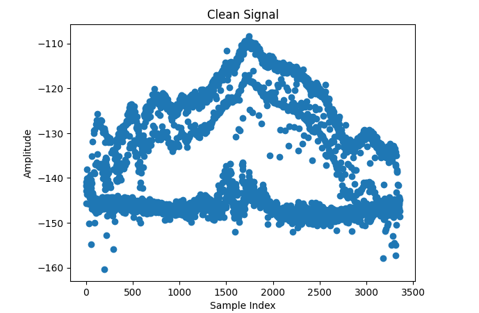 

still not really processed as it can be seen. There are some mirror at a -10dB, and it is shit. It is the easiest way to be 5 dB away from the correct value. But maybe the data is correct in both cases...

# It is SONATE-2_20241013T134447

it is predictable but it is weird

What happens in the waterfall plot?
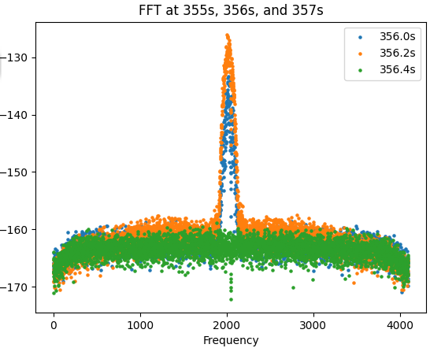

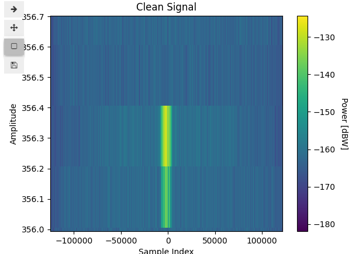
It somehow looks like the signal is creating noise at a lot of frequencies... But it is hard to know how often the strong signal is coming and when the weaker one is coming.

I cannot see a simple pattern
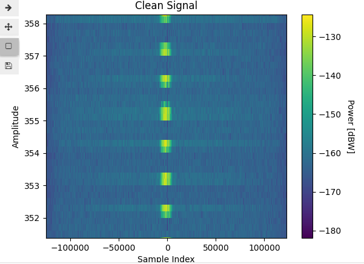

And the noise changes very rapidly
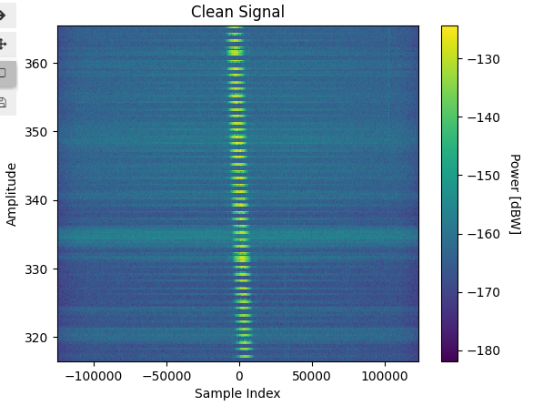

It often coindices with a transmitted signal. Is it because the LNA or the ADC is driven near saturation resulting in noise? I tried finding 3 different times, one where the transmitter is transmitting, one where the noise is low, and one where the noise is high even though the transmitter is not transmitting

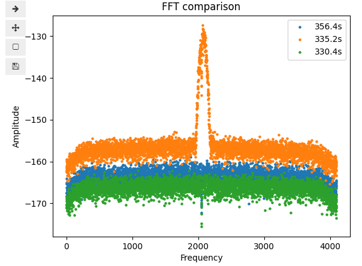

It is pretty intense. It is a difference of 20 dB or 100 times larger noise power when the transmitter is active. Wtf

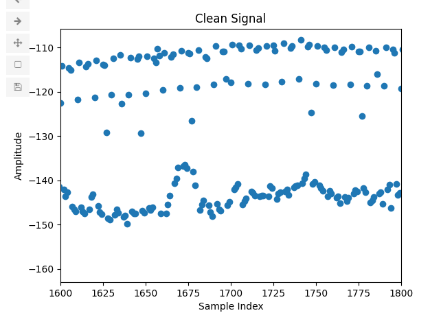
I see two options: choosing another satellite or making classification on the signal to find out whether the transmitter is transmitting at power level: off,low,high. This should also be possible to use in real time.

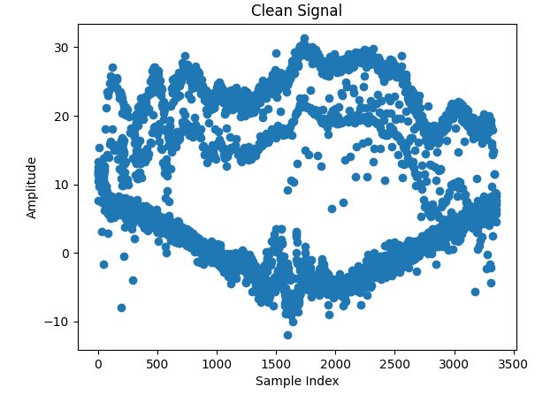
When FSPL is subtracted it looks rather haha

# VZLUSAT-2

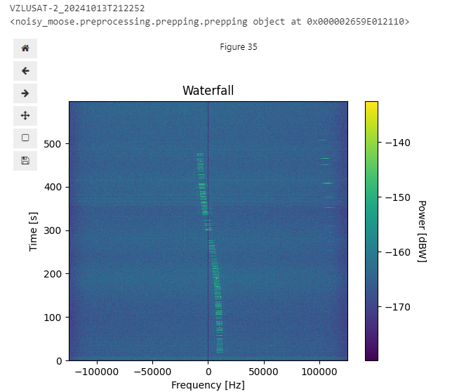
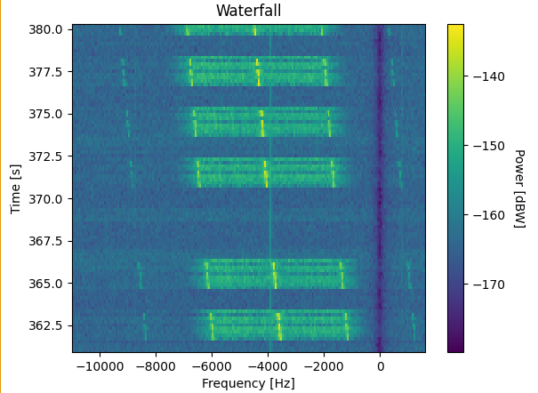
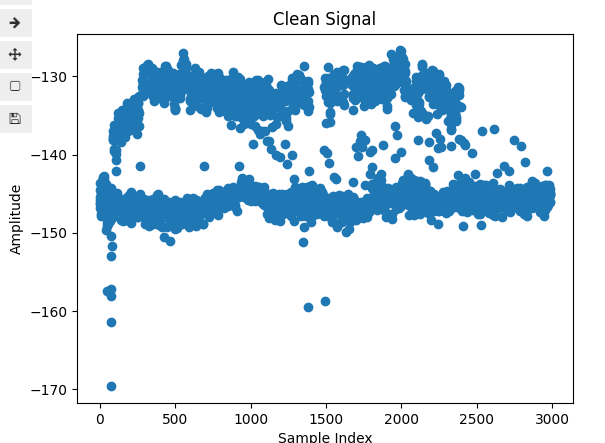
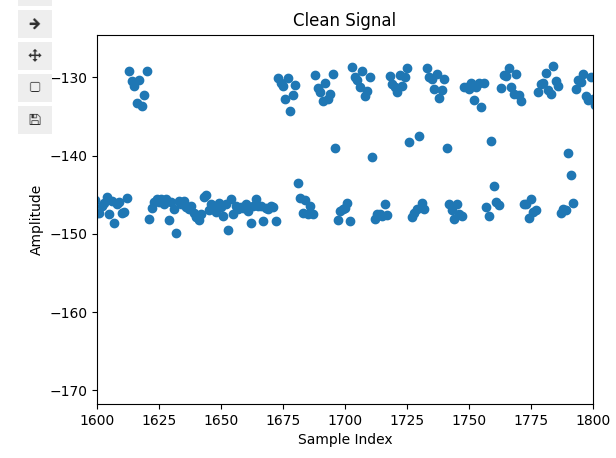
Notice how it does not show that high of a mountain shape...

Still it requires a lot of processing. VERY NICE FOR the project that the data is not just clean
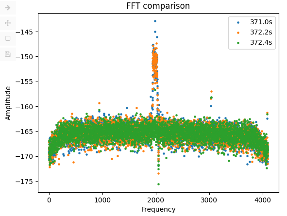

Same satellite same day i think
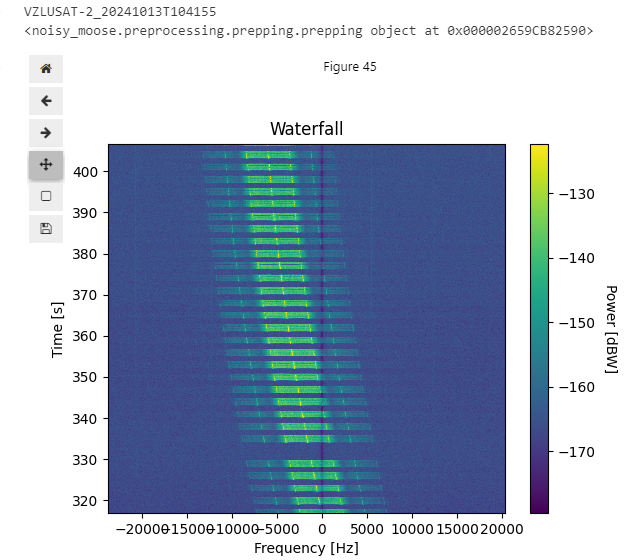
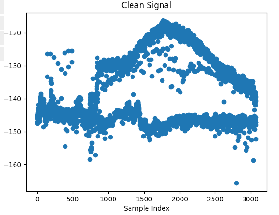
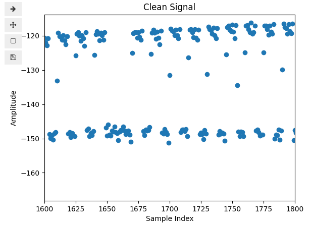
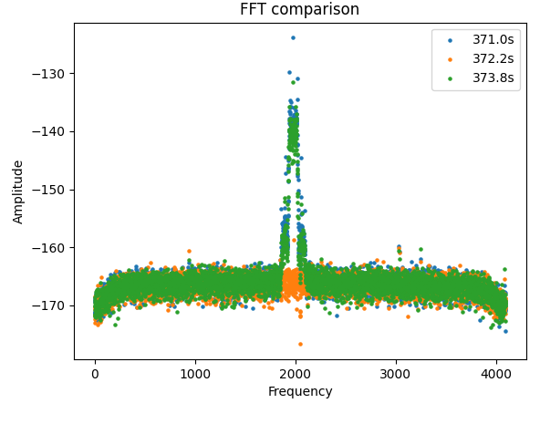

Same satellite same day i think again
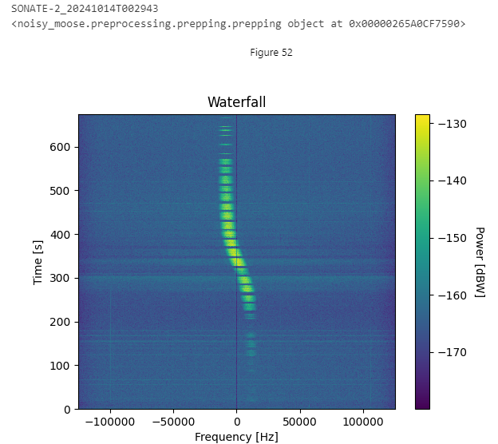
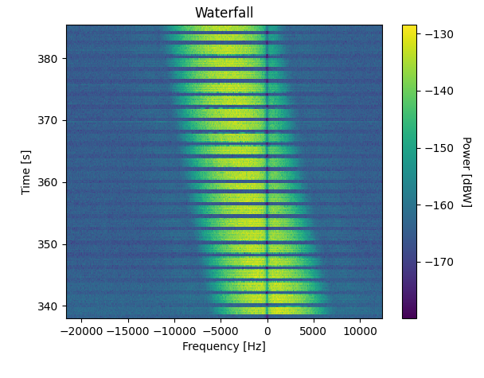
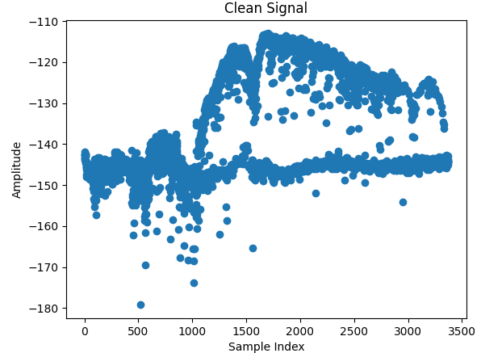
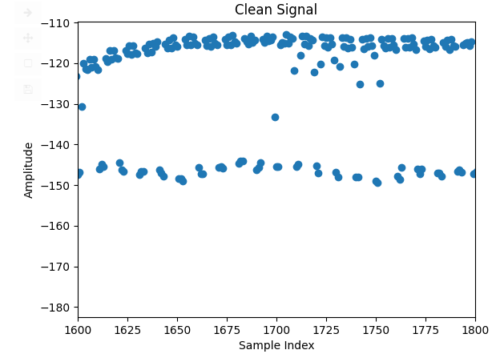

Completely different passes even though it is the same satellite. WHAT THE FUCK

# GRBALPHA
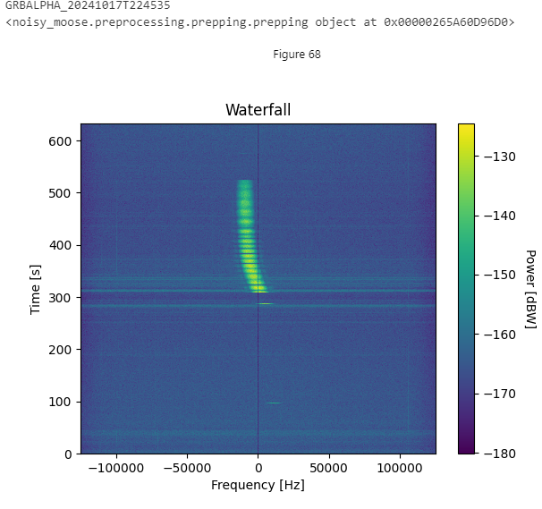
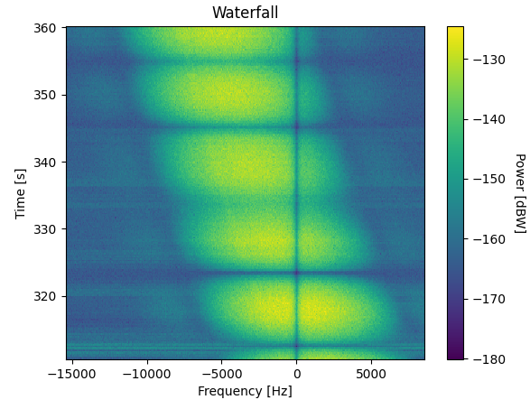
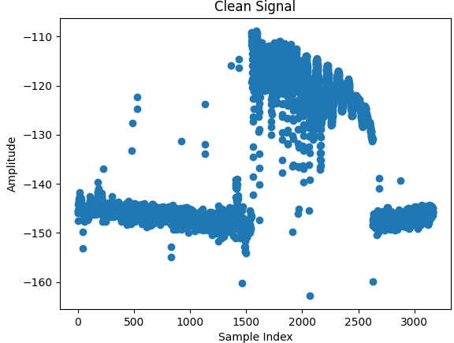

VERY NICE. Definitely the first satellite to work with. Tried to remove the FSPL as well

It is all good. Very nice very good

