If no processing is present the FSPL corrected signal power looks like this
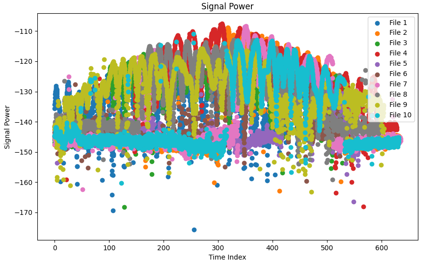
Removing the FSPL
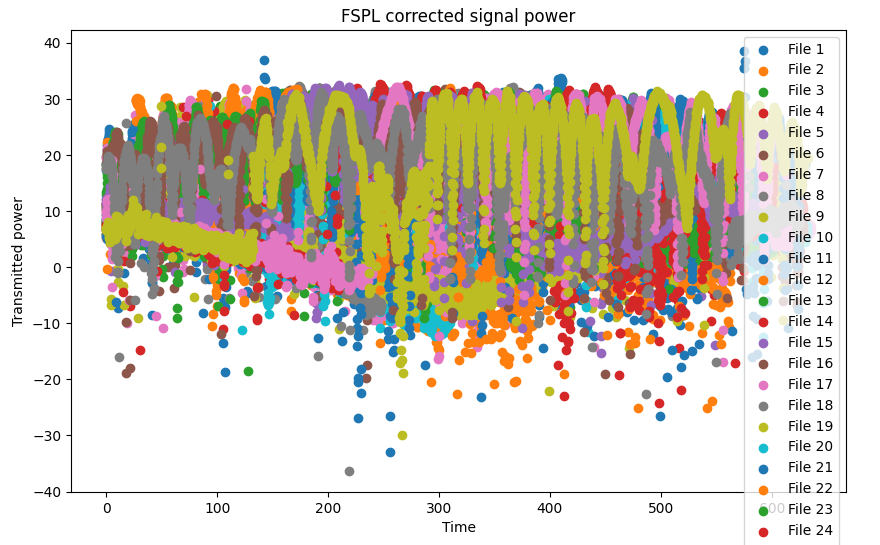

Simple thresholding analysis
from

to
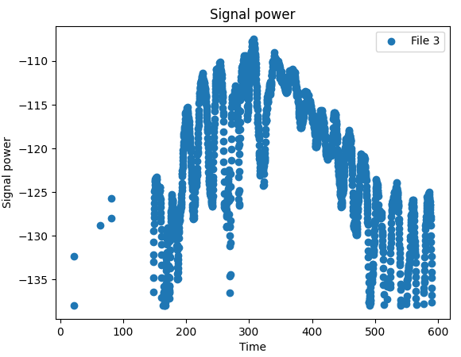

Done for all using the threshold -138dBm
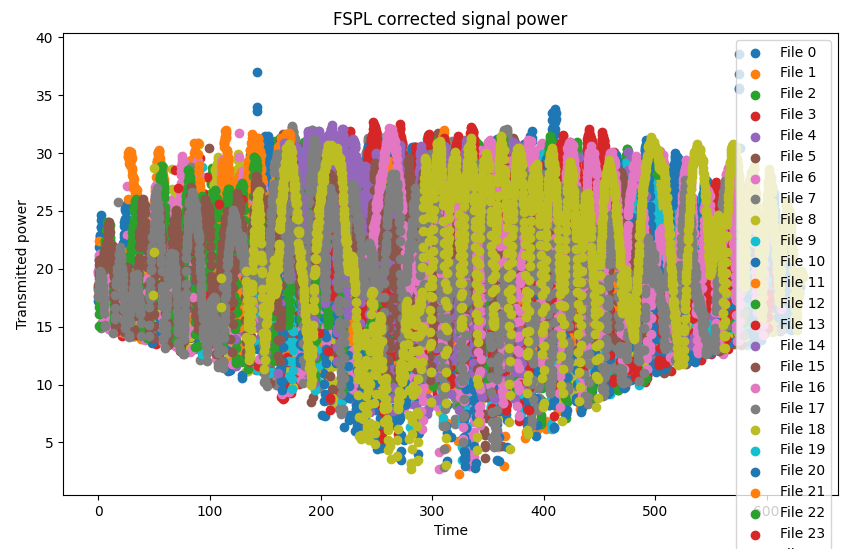

Only issue is that the threshold might not work for all...
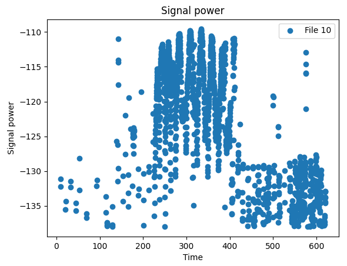

Therefore it could make sense to play around with histogram. Just delete all the points under the one with the most points, or do some sick ass machine learning
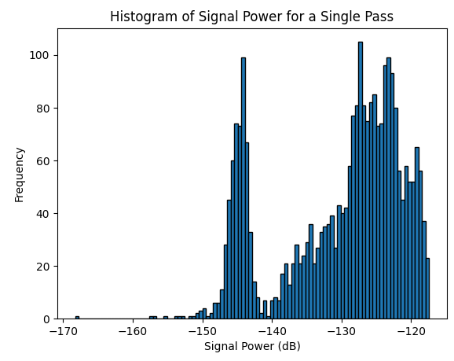
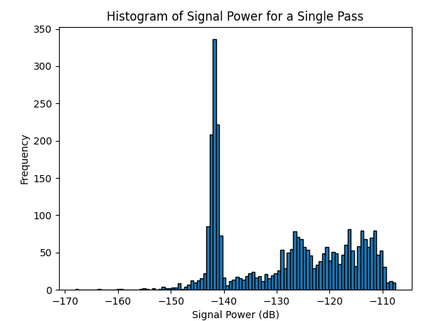
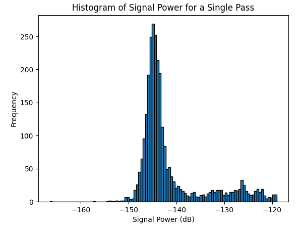
It works for most, but not for 
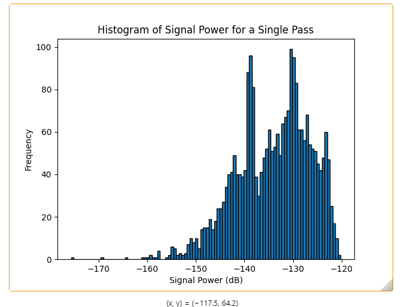
as the signal is just foookin transmitting at all times
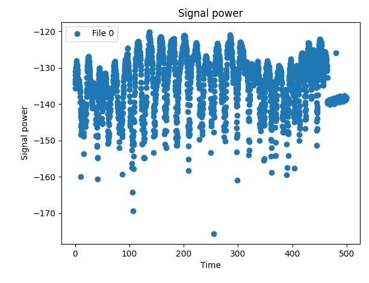
But that is very rare and it might still work

Apparently it is a bit messy... We fix by making histogram

I still think the histogram should be a great possibility. Another possibility is taken a mean of all the histograms, but it is not that cool

I found out it was possible to change the variance of the clusters. It seem some improvements

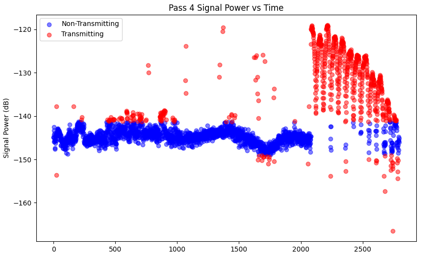 
this is too much, but it is still rather interesting
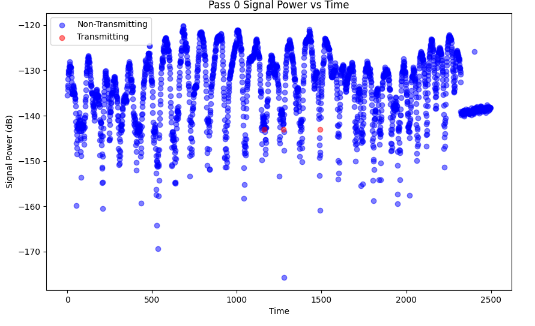
It also misses this one.

Now we cooking
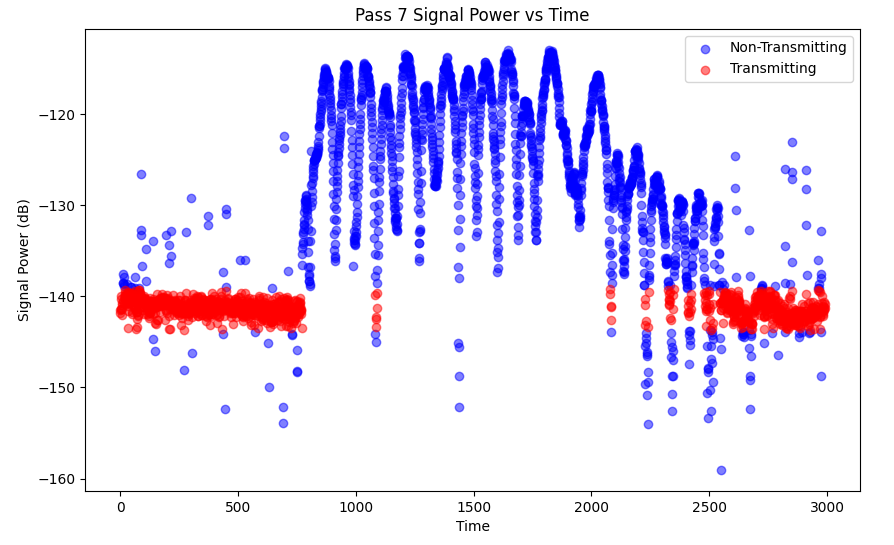
It makes these histograms for all, and for some it is really good, others are more wack. may
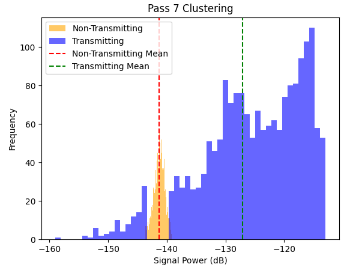

I still think the simple linear threshold with a -138dBm might still be the best, but I am cooking

This is a bit stupider way, one would think
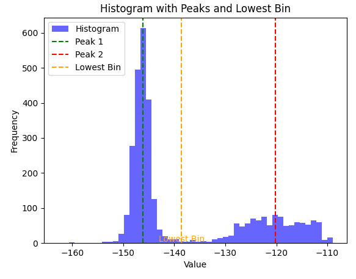

I think there is something like LDA where it tries to minimise the variance between each group while maximising the spread between two groups. That is exactly what i want, and the following is just a bad version

But it is still cooking territory. The better we remove the noise, the better the model will be i think. I am also allowed not to train on dataset that brings trouble