If no processing is present the FSPL corrected signal power looks like this

Removing the FSPL

Simple thresholding analysis
from

to

Done for all using the threshold -138dBm

Only issue is that the threshold might not work for all...

Therefore it could make sense to play around with histogram. Just delete all the points under the one with the most points, or do some sick ass machine learning

It works for most, but not for 

as the signal is just foookin transmitting at all times

But that is very rare and it might still work

Apparently it is a bit messy... We fix by making histogram

I still think the histogram should be a great possibility. Another possibility is taken a mean of all the histograms, but it is not that cool

I found out it was possible to change the variance of the clusters. It seem some improvements

 
this is too much, but it is still rather interesting

It also misses this one.

Now we cooking

It makes these histograms for all, and for some it is really good, others are more wack. may

I still think the simple linear threshold with a -138dBm might still be the best, but I am cooking

This is a bit stupider way, one would think

I think there is something like LDA where it tries to minimise the variance between each group while maximising the spread between two groups. That is exactly what i want, and the following is just a bad version

But it is still cooking territory. The better we remove the noise, the better the model will be i think. I am also allowed not to train on dataset that brings trouble

I did it with a threshold on a moving average, and it is working really nice.

After removing the data points where it is not transmitting, i tried to see the relation of each of the features. Most of them are completely flat, which means that there is nothing to gain from making linear regression for example.

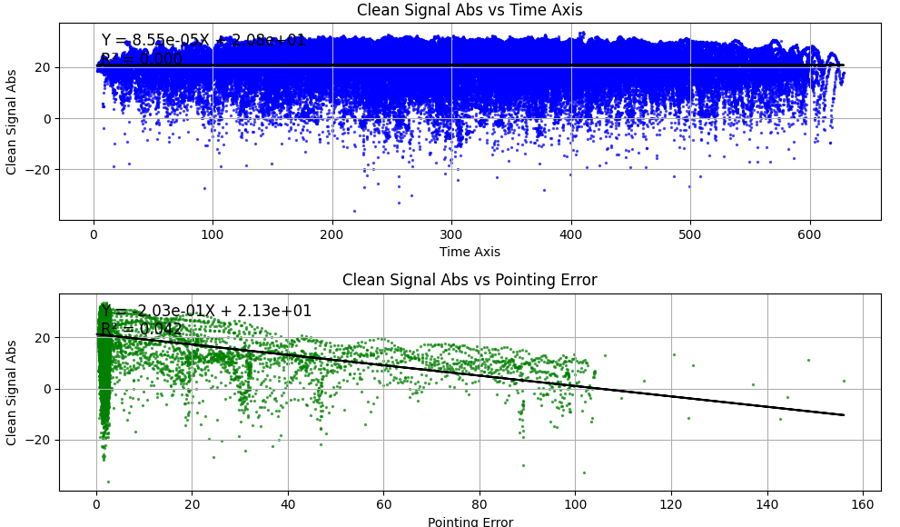
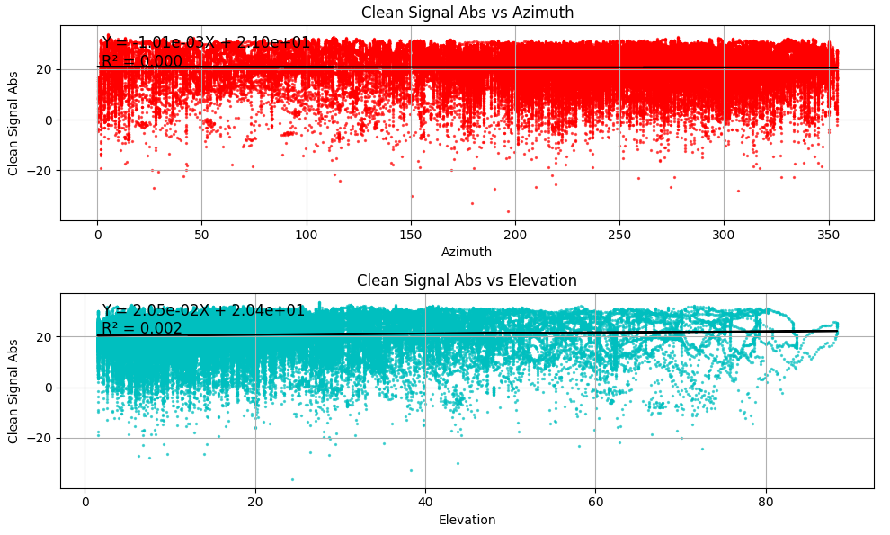

There might be something to see from the FSPL, where accoring to the trend, there is a 2 db gain in signal strength not explained by the FSPL when the satellite is closest. If there was something like atmosphere attenuation, this is something we could see, where the signal is better than just explained by the shorter distance. 
There is a quite clear trend that pointing error equals a lower signal. Here the points where the pointing error is below 0 should probably just die as it can change the bias.

The Elevation and FSPL looks equal, as it is equal if the orbit is circular. It is.

Where the noise power os biggest the signal is also biggest, but that is maybe just shit.

The pointing error comes at higher elevation as the satellite is closer, but it is not due to a direct overhead pass. Instead it is due to the azimuth being slower
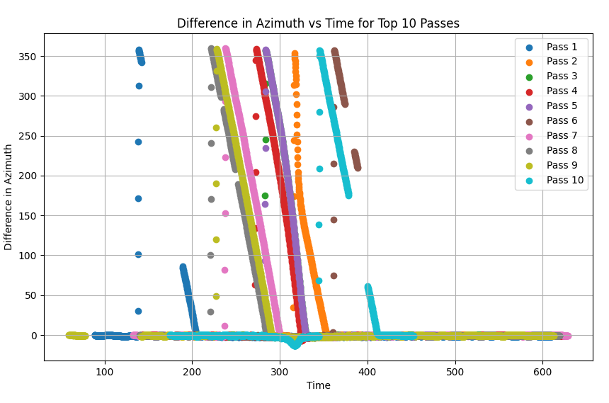
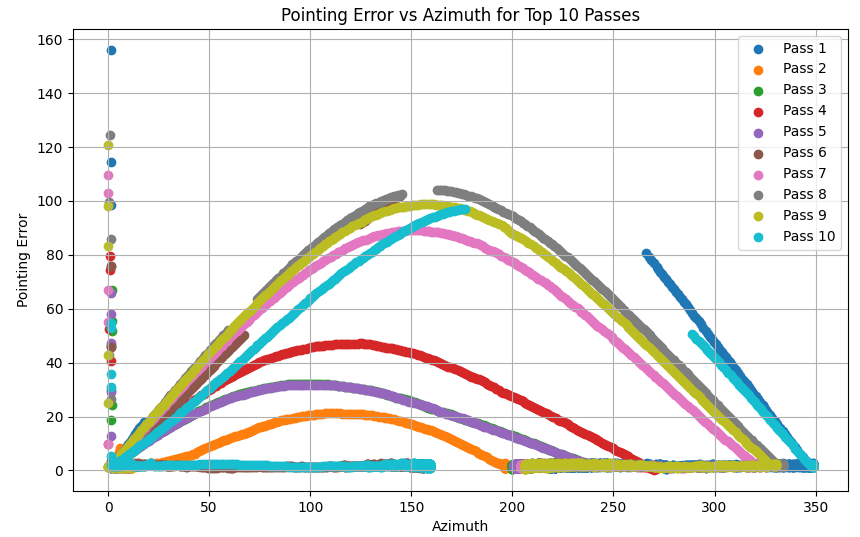
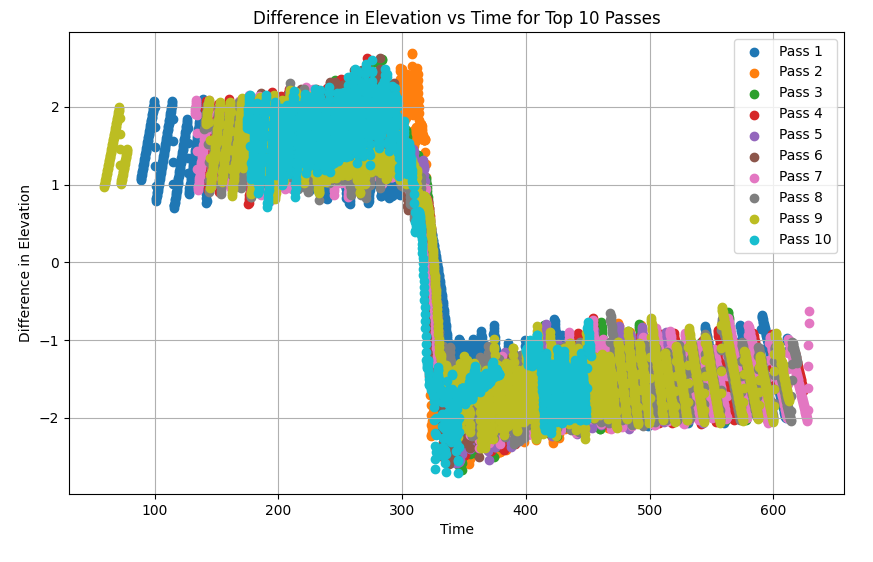
The elevation is only ever 2 degrees off.

The straight lines taking 40 seconds to fix seems like the azimuth goes from 0 to 360 the wrong way, and afterwards follow like it is no problem.
It always happened at the top point of the specific pass. It looks like a coding error and thereby something that could be fixed.

There are also mistakes happening due to the very first

It looks like the waterfall plots change very quickly when the station is moving
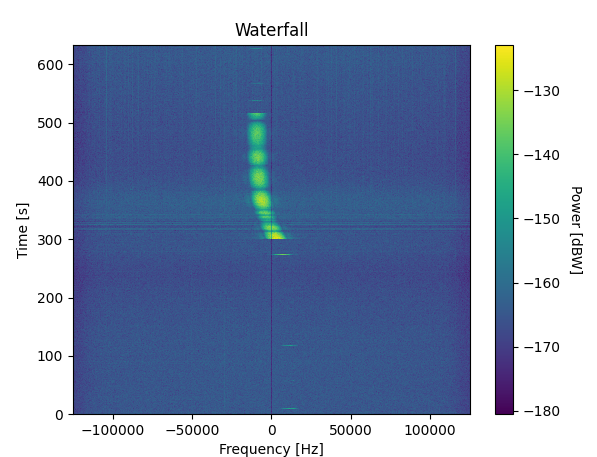
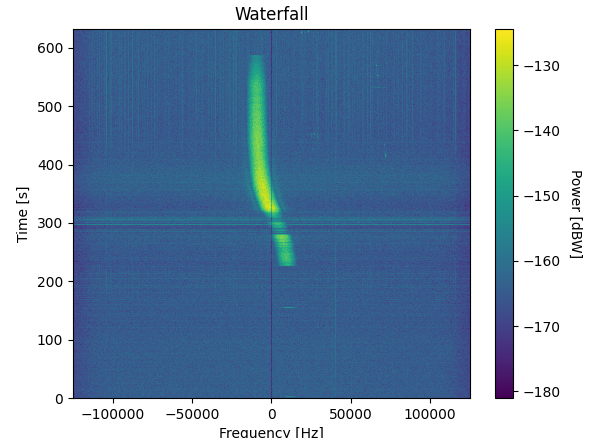
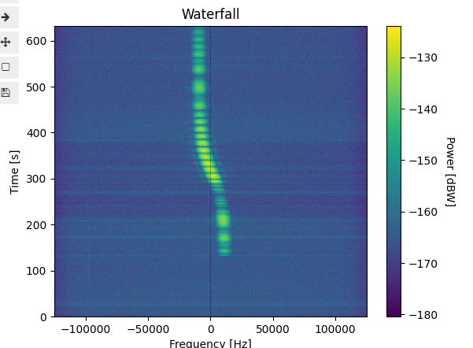

The set azimuth is interpolated by a simple method, but the control system definitely choosing the wrong way around the azimuth 0-360 change. It 
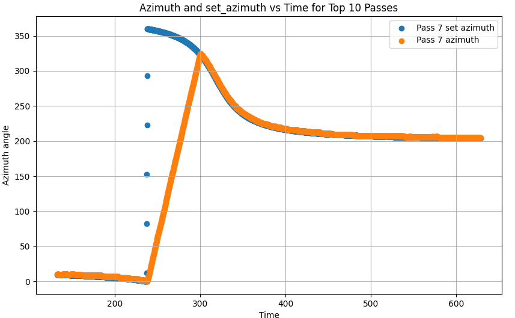
It even shows how the control system is easily able to catch up to the quickest section of the pass. Correction, when it is directly overhead, it is not possible to keep up

# periodic behaviour
We can see that there is a lot of periodic behaviour. How to find how periodic it is? We can make a fft from the passes, but the fft requires the points to be uniformly distributed. I dont think it is necessary for a general discrete time fourier transformation. There is a thing called Lomb-Scargle Periodogram:
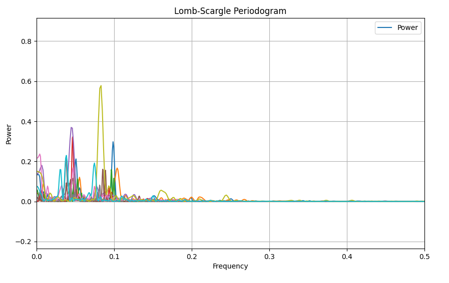
It apparently did not give a sheit about the mean of the data of -130... It had auto normalise as a default, very smartly.

Another idea is to estimate the noise floor from a histogram of the noise. This would completely remove the outliers, and if the amplitude of the noise is really gaussian the point in the top will be close to the real noise power.

I see peaks from around 0.01 to 0.1, which corresponds to periods from 100 to 10 seconds. This seems reasonable. Now the question is whether it is possible to predict when the satellite is spinning at a specific frequency. I could save the frequency of the two largest peaks.

But how would i compare the frequency to anything useful? It is just a constant during a pass, and i have no change no information of a whole pass. I could make something like:

Max elevation
Azimuth at max peak
Mean signal strenght

The upper two could maybe show that a directly overpass has a strong periodicity.
Alternatively i could create wavelets

The signal is just a normal sine, but the log creates peaks
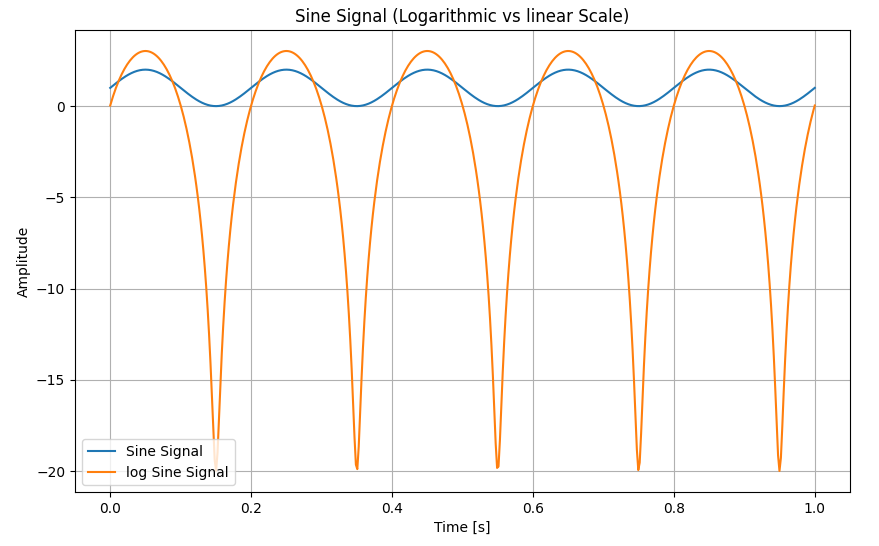

Using sliding windows to find how the frequency changes over time, a lot of not that useful information was found, but it actually seemed to work
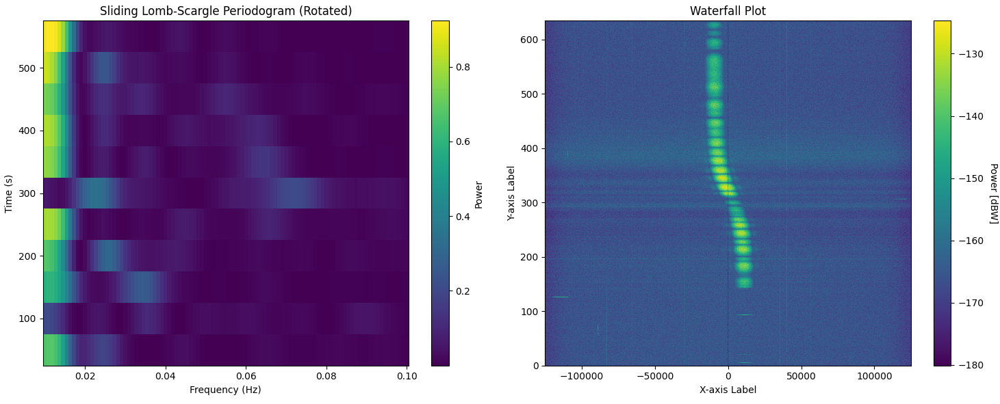 

Notice how the changes at a higher frequency than 0 can be seen. Maybe the window size has to go up, but it is at 100, so it is quite large..., but it is also hamming windowed, so not totally useless.

I do not like that the frequency is clinging to the DC... there is a slope or mean that ruins it.

Tried to do it with 300 and a 80% overlap between periodograms, and it shows something not useless.  
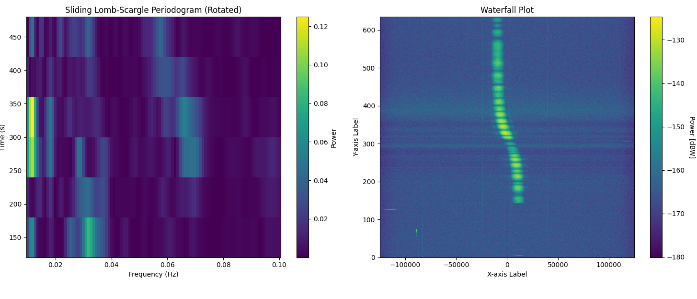
Maybe I should try a much larger overlap to make a smoother transition between frequency components and time. This could make it possible to find out how high the probability a specific frequency spin is

One method to get a higher frequency resolution of the lomb scargle is to use the IQ samples to calculate it with a much higher time resolution, and then not that high frequency analysis.

This is a link to someone who found the tumbling rate of a satellite, however it was easy for them, and i dont really understand how they did not give a shit about the vector from the ground station for the RF analysis.
https://digitalcommons.usu.edu/cgi/viewcontent.cgi?article=4290&context=smallsat

Out of memory...
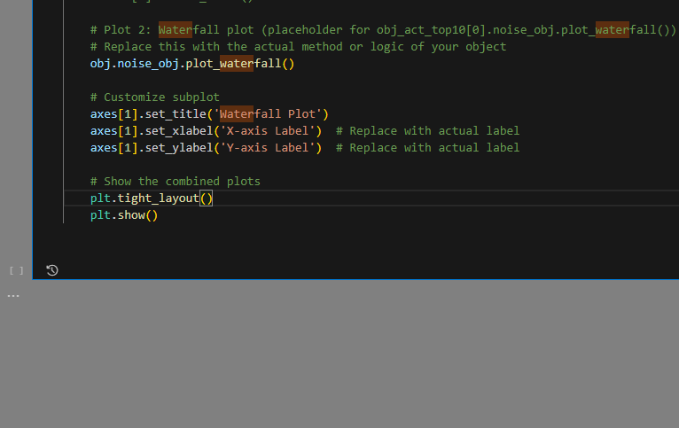

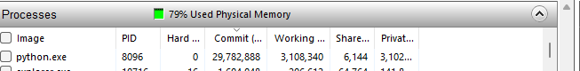
Trying to save 30 gigs in ram. I should try to delete all the shit that i do not need...

