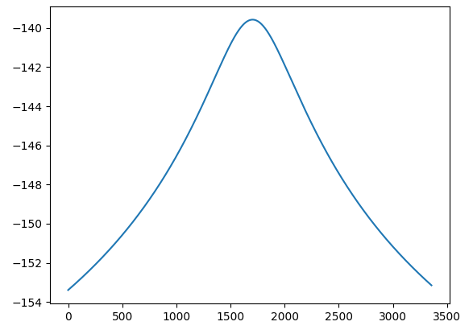
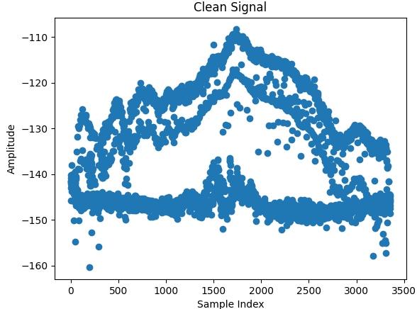
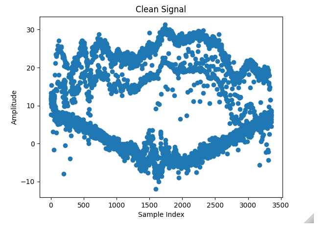

Power of signal example
 -120dBW when closest, -130 further away.

FSPL -140 when closest  -150 further away

When subtracting the FSPL from the power of the signal, we would have to need the transmission power or simply normalise the FSPL so the FSPL is 0 when the satellite is the farthest, and maybe 12 when the satellite is closest.
Before subtracting the FSPL the y-axis meant something, now it does not, or so I thought

and 

It results in the following

It actually does mean something, it is the transmission power at the satellite. However it is not important, so we could normalise the signal power to lay around 0 or whatever value we would like, as the FSPL is removing the trend no matter what

